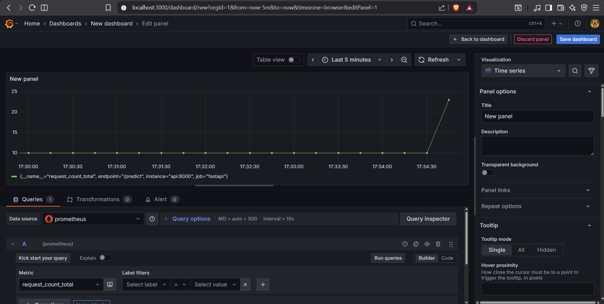
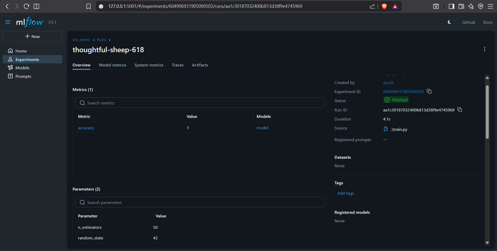

# 🌸 MLOps Iris Classification Project

A complete end-to-end MLOps pipeline for Iris flower species classification using Machine Learning, featuring model training with MLflow tracking, FastAPI deployment, Streamlit frontend, and comprehensive monitoring with Prometheus and Grafana.


---

## 📋 Table of Contents

- [Overview](#overview)
- [Architecture](#architecture)
- [Features](#features)
- [Tech Stack](#tech-stack)
- [Project Structure](#project-structure)
- [Prerequisites](#prerequisites)
- [Installation & Setup](#installation--setup)
- [Usage](#usage)
- [API Endpoints](#api-endpoints)
- [Monitoring](#monitoring)
- [CI/CD Pipeline](#cicd-pipeline)
- [Screenshots](#screenshots)
- [Future Enhancements](#future-enhancements)
- [Contributing](#contributing)
- [License](#license)

---

## 🎯 Overview

This project demonstrates a production-ready MLOps pipeline for a machine learning classification task. It uses the classic Iris dataset to predict flower species (Setosa, Versicolor, Virginica) based on sepal and petal measurements.

### Key Highlights:

- **ML Model**: Random Forest Classifier trained on Iris dataset
- **Experiment Tracking**: MLflow for tracking experiments, parameters, and models
- **API Service**: FastAPI REST API for real-time predictions
- **Frontend**: Interactive Streamlit web application
- **Monitoring**: Prometheus metrics collection and Grafana dashboards
- **Containerization**: Docker Compose for orchestrating all services
- **CI/CD**: GitHub Actions for automated testing and deployment

---

## 🏗️ Architecture

```
┌─────────────────────────────────────────────────────────────┐
│                    Client Applications                       │
│          (Browser, cURL, Postman, Streamlit UI)             │
└────────────────────┬────────────────────────────────────────┘
                     │
                     ▼
┌─────────────────────────────────────────────────────────────┐
│                   FastAPI Application                        │
│  ┌────────────────┬──────────────┬─────────────────┐        │
│  │  /predict      │   /health    │    /metrics     │        │
│  │  (ML Model)    │  (Status)    │  (Prometheus)   │        │
│  └────────────────┴──────────────┴─────────────────┘        │
└────────────┬────────────────────────────┬───────────────────┘
             │                            │
             ▼                            ▼
┌─────────────────────────┐    ┌────────────────────────────┐
│   MLflow Tracking       │    │    Prometheus Scraper      │
│   - Experiments         │    │    - Metrics Collection    │
│   - Model Registry      │    │    - Time Series DB        │
│   - Parameters & Metrics│    └────────────┬───────────────┘
└─────────────────────────┘                 │
                                            ▼
                                   ┌────────────────────────┐
                                   │   Grafana Dashboard    │
                                   │   - Visualizations     │
                                   │   - Alerts & Monitoring│
                                   └────────────────────────┘
```

### Component Flow:

1. **Training Phase**: 
   - `train.py` trains a Random Forest model on Iris dataset
   - MLflow tracks experiments, logs parameters, metrics, and models
   - Trained model is saved to `models/iris_rf.pkl`

2. **Deployment Phase**:
   - FastAPI loads the trained model on startup
   - Exposes REST API endpoints for predictions
   - Prometheus client instruments the API with metrics

3. **Monitoring Phase**:
   - Prometheus scrapes `/metrics` endpoint every 5 seconds
   - Grafana visualizes metrics from Prometheus
   - Real-time monitoring of request rates, latency, and system health

4. **User Interface**:
   - Streamlit provides an interactive web UI
   - Users can make single or batch predictions
   - Visual feedback with species information

---

## ✨ Features

### 🤖 Machine Learning
- **Model**: Random Forest Classifier with scikit-learn
- **Dataset**: Iris flower dataset (4 features, 3 classes)
- **Experiment Tracking**: Complete MLflow integration
- **Model Versioning**: Track multiple model iterations
- **Metrics**: Accuracy tracking and evaluation

### 🚀 API & Deployment
- **FastAPI**: High-performance async REST API
- **Endpoints**: Health check, predictions, and metrics
- **Request Validation**: Pydantic models for type safety
- **Documentation**: Auto-generated Swagger/OpenAPI docs
- **Docker**: Multi-container orchestration with Docker Compose

### 📊 Monitoring & Observability
- **Prometheus**: Metrics collection and time-series storage
- **Grafana**: Real-time dashboards and visualizations
- **Custom Metrics**: Request count, latency, and API status
- **Health Checks**: Endpoint monitoring and alerting

### 🎨 User Interface
- **Streamlit**: Interactive web application
- **Single Predictions**: Slider inputs for flower measurements
- **Batch Predictions**: CSV upload for bulk processing
- **Visualizations**: Charts and species information
- **API Status**: Real-time connection monitoring

### 🔄 CI/CD
- **GitHub Actions**: Automated testing pipeline
- **Automated Tests**: Pytest integration
- **Code Quality**: Linting and validation
- **Continuous Integration**: Build and test on every push

---

## 🛠️ Tech Stack

### Core Technologies
| Technology | Purpose | Version |
|-----------|---------|---------|
| **Python** | Programming Language | 3.10+ |
| **scikit-learn** | Machine Learning | 1.7.2 |
| **FastAPI** | REST API Framework | 0.120+ |
| **MLflow** | Experiment Tracking | 3.5+ |
| **Streamlit** | Frontend UI | 1.50+ |
| **Prometheus** | Metrics Collection | Latest |
| **Grafana** | Monitoring Dashboard | Latest |
| **Docker** | Containerization | Latest |

### Key Libraries
- **pandas**: Data manipulation
- **numpy**: Numerical computing
- **joblib**: Model serialization
- **uvicorn**: ASGI server
- **prometheus-client**: Metrics instrumentation
- **pytest**: Testing framework
- **httpx**: Async HTTP client

---

## 📁 Project Structure

```
mlops_mini_project/
├── .github/
│   └── workflows/
│       └── ci-cd.yml              # GitHub Actions CI/CD pipeline
├── app/
│   ├── app.py                     # FastAPI application
│   ├── train.py                   # Model training script
│   ├── frontend.py                # Streamlit UI application
│   ├── test_api.py                # API tests
│   ├── models_utils.py            # Utility functions
│   ├── requirements.txt           # Python dependencies
│   ├── dockerfile                 # Docker image for API
│   └── mlruns/                    # MLflow tracking data
├── grafana/
│   └── dashboards/
│       └── fastapi-dashboard.json # Grafana dashboard config
├── prometheus/
│   └── prometheus.yml             # Prometheus configuration
├── images/
│   ├── grafana.png                # Grafana dashboard screenshot
│   └── mlflow.png                 # MLflow UI screenshot
├── models/
│   └── iris_rf.pkl                # Trained model file
├── mlruns/                        # MLflow experiment tracking
├── docker-compose.yml             # Multi-service orchestration
├── requirements.txt               # Root dependencies
└── README.md                      # This file
```

---

## 📦 Prerequisites

Before you begin, ensure you have the following installed:

- **Python 3.10+** - [Download](https://www.python.org/downloads/)
- **Docker Desktop** - [Download](https://www.docker.com/products/docker-desktop/)
- **Git** - [Download](https://git-scm.com/downloads)
- **VS Code** (recommended) - [Download](https://code.visualstudio.com/)

### System Requirements
- **RAM**: Minimum 8GB (16GB recommended)
- **Disk Space**: 5GB free space
- **OS**: Windows 10/11, macOS, or Linux

---

## 🚀 Installation & Setup

### 1. Clone the Repository

```bash
git clone https://github.com/AyushChoudhary6/mlops_mini_project.git
cd mlops_mini_project
```

### 2. Create Virtual Environment

**Windows (PowerShell):**
```powershell
python -m venv .venv
.\.venv\Scripts\Activate.ps1
```

**Linux/macOS:**
```bash
python3 -m venv .venv
source .venv/bin/activate
```

### 3. Install Dependencies

```bash
pip install -r app/requirements.txt
```

### 4. Train the Model

```bash
cd app
python train.py
```

**Expected Output:**
```
✅ Model trained and logged. Accuracy: 1.0000
```

This will:
- Train a Random Forest model on the Iris dataset
- Log the experiment to MLflow
- Save the model to `models/iris_rf.pkl`

### 5. Run with Docker Compose (Recommended)

**Start all services:**
```bash
docker-compose up --build
```

This starts:
- **MLflow UI**: http://localhost:5001
- **FastAPI**: http://localhost:8000
- **Prometheus**: http://localhost:9090
- **Grafana**: http://localhost:3000

### 6. Run Locally (Without Docker)

**Terminal 1 - FastAPI:**
```bash
cd app
python -m uvicorn app:app --reload --host 0.0.0.0 --port 8000
```

**Terminal 2 - MLflow:**
```bash
mlflow ui --port 5001
```

**Terminal 3 - Streamlit:**
```bash
cd app
streamlit run frontend.py
```

---

## 💻 Usage

### 🌐 Access the Applications

| Service | URL | Description |
|---------|-----|-------------|
| **FastAPI Docs** | http://localhost:8000/docs | Interactive API documentation |
| **Streamlit UI** | http://localhost:8501 | Web interface for predictions |
| **MLflow UI** | http://localhost:5001 | Experiment tracking dashboard |
| **Prometheus** | http://localhost:9090 | Metrics and targets |
| **Grafana** | http://localhost:3000 | Monitoring dashboards |

### 📱 Making Predictions

#### Option 1: Streamlit UI (Easiest)

1. Open http://localhost:8501
2. Adjust the sliders for flower measurements:
   - Sepal Length (4.0 - 8.0 cm)
   - Sepal Width (2.0 - 4.5 cm)
   - Petal Length (1.0 - 7.0 cm)
   - Petal Width (0.1 - 2.5 cm)
3. Click **"Predict Species"**
4. View the predicted species with details

**For Batch Predictions:**
- Upload a CSV file with columns: `sepal_length`, `sepal_width`, `petal_length`, `petal_width`
- Click **"Predict All"**
- Download results as CSV

#### Option 2: FastAPI Docs (Interactive)

1. Open http://localhost:8000/docs
2. Click on **POST /predict**
3. Click **"Try it out"**
4. Enter JSON payload:
```json
{
  "inputs": [[5.1, 3.5, 1.4, 0.2]]
}
```
5. Click **"Execute"**

#### Option 3: cURL (Command Line)

```bash
curl -X POST "http://localhost:8000/predict" \
  -H "Content-Type: application/json" \
  -d '{"inputs": [[5.1, 3.5, 1.4, 0.2]]}'
```

**Response:**
```json
{
  "predictions": [0]
}
```

**Species Mapping:**
- `0` = Setosa
- `1` = Versicolor
- `2` = Virginica

#### Option 4: Python Script

```python
import requests

url = "http://localhost:8000/predict"
data = {
    "inputs": [
        [5.1, 3.5, 1.4, 0.2],  # Setosa
        [6.5, 3.0, 5.2, 2.0],  # Virginica
        [5.7, 2.8, 4.1, 1.3]   # Versicolor
    ]
}

response = requests.post(url, json=data)
print(response.json())
# Output: {"predictions": [0, 2, 1]}
```

---

## 📡 API Endpoints

### POST /predict
Make predictions on iris flower measurements.

**Request:**
```json
{
  "inputs": [
    [5.1, 3.5, 1.4, 0.2],
    [6.7, 3.1, 4.7, 1.5]
  ]
}
```

**Response:**
```json
{
  "predictions": [0, 1]
}
```

### GET /health
Check API health status.

**Response:**
```json
{
  "status": "ok"
}
```

### GET /metrics
Prometheus metrics endpoint.

**Response:** (Plain text Prometheus format)
```
# HELP request_count_total API request count
# TYPE request_count_total counter
request_count_total{endpoint="/predict"} 42.0
...
```

### GET /docs
Interactive API documentation (Swagger UI).

### GET /redoc
Alternative API documentation (ReDoc).

---

## 📊 Monitoring

### Prometheus Metrics

The API exposes the following custom metrics:

| Metric | Type | Description |
|--------|------|-------------|
| `request_count_total` | Counter | Total number of API requests by endpoint |
| `request_latency_seconds` | Summary | Request latency in seconds |
| `up` | Gauge | Service availability (1=up, 0=down) |

**Access Prometheus:**
- URL: http://localhost:9090
- Targets: http://localhost:9090/targets
- Graph: http://localhost:9090/graph

**Example Queries:**
```promql
# Request rate per second
rate(request_count_total[1m])

# Average latency
rate(request_latency_seconds_sum[5m]) / rate(request_latency_seconds_count[5m])

# API uptime
up{job="fastapi"}
```

### Grafana Dashboards



**Access Grafana:**
- URL: http://localhost:3000
- **Default Login:**
  - Username: `admin`
  - Password: `admin`

**Setup Data Source:**
1. Go to Configuration → Data Sources
2. Click "Add data source"
3. Select "Prometheus"
4. Set URL: `http://prometheus:9090`
5. Click "Save & Test"

**Create Dashboard:**
1. Click "+" → "Dashboard"
2. Click "Add visualization"
3. Select "prometheus" data source
4. Use queries like:
   - `request_count_total` (Total Requests)
   - `rate(request_count_total[1m])` (Request Rate)
   - `up{job="fastapi"}` (API Status)

**Import Pre-built Dashboard:**
1. Click "+" → "Import dashboard"
2. Upload: `grafana/dashboards/fastapi-dashboard.json`
3. Select Prometheus data source
4. Click "Import"

### MLflow Tracking



**Access MLflow:**
- URL: http://localhost:5001

**Features:**
- View all experiment runs
- Compare model parameters and metrics
- Track model versions
- Download trained models
- View model artifacts

**View Experiments:**
1. Navigate to http://localhost:5001
2. Click on "iris_demo" experiment
3. View runs with parameters and metrics
4. Compare different model configurations

---

## 🔄 CI/CD Pipeline

The project includes a GitHub Actions workflow for continuous integration and deployment.

**Workflow File:** `.github/workflows/ci-cd.yml`

### Pipeline Stages:

1. **Checkout Code**: Clone repository
2. **Setup Python**: Install Python 3.10
3. **Install Dependencies**: Install required packages
4. **Run Tests**: Execute pytest test suite

**Trigger:** Automatically runs on:
- Push to `main` branch
- Pull requests to `main` branch

**View Workflow:**
- Go to: https://github.com/AyushChoudhary6/mlops_mini_project/actions

### Running Tests Locally:

```bash
cd app
pytest test_api.py -v
```

**Expected Output:**
```
test_api.py::test_health_endpoint PASSED
test_api.py::test_predict_endpoint PASSED
test_api.py::test_metrics_endpoint PASSED
```

---

## 📸 Screenshots

### MLflow Experiment Tracking

*Track experiments, compare models, and manage the model lifecycle*

### Grafana Monitoring Dashboard

*Real-time monitoring of API performance and system metrics*

---

## 🔮 Future Enhancements

- [ ] **Model Versioning**: A/B testing with multiple model versions
- [ ] **Authentication**: API key-based authentication
- [ ] **Rate Limiting**: Protect API from abuse
- [ ] **Caching**: Redis for faster predictions
- [ ] **Advanced Models**: Deep learning alternatives
- [ ] **Data Drift Detection**: Monitor input data distribution
- [ ] **Model Retraining**: Automated retraining pipeline
- [ ] **Kubernetes Deployment**: Scale with K8s
- [ ] **Advanced Monitoring**: Custom Grafana alerts
- [ ] **Feature Store**: Centralized feature management
- [ ] **Model Explainability**: SHAP/LIME integration
- [ ] **Multi-model Support**: Deploy multiple models

---

## 🤝 Contributing

Contributions are welcome! Here's how you can help:

1. **Fork the repository**
2. **Create a feature branch**
   ```bash
   git checkout -b feature/amazing-feature
   ```
3. **Make your changes**
4. **Commit your changes**
   ```bash
   git commit -m "Add amazing feature"
   ```
5. **Push to the branch**
   ```bash
   git push origin feature/amazing-feature
   ```
6. **Open a Pull Request**

### Development Guidelines:
- Follow PEP 8 style guide
- Add tests for new features
- Update documentation
- Keep commits atomic and descriptive

---

## 📝 License

This project is licensed under the MIT License - see the [LICENSE](LICENSE) file for details.

---

## 🙏 Acknowledgments

- **Iris Dataset**: R.A. Fisher (1936)
- **FastAPI**: Sebastián Ramírez
- **MLflow**: Databricks
- **Streamlit**: Streamlit Inc.
- **scikit-learn**: scikit-learn developers

---

## 📧 Contact

**Ayush Choudhary**
- GitHub: [@AyushChoudhary6](https://github.com/AyushChoudhary6)
- Repository: [mlops_mini_project](https://github.com/AyushChoudhary6/mlops_mini_project)

---

## 🚦 Project Status


**Current Version:** 1.0.0

**Status:** ✅ Production Ready

---

## 💡 Tips & Troubleshooting

### Common Issues:

1. **Port Already in Use**
   ```bash
   # Find and kill the process
   # Windows
   netstat -ano | findstr :8000
   taskkill /PID <PID> /F
   
   # Linux/Mac
   lsof -ti:8000 | xargs kill -9
   ```

2. **Docker Desktop Not Running**
   - Start Docker Desktop application
   - Wait for it to fully initialize

3. **Model File Not Found**
   ```bash
   # Retrain the model
   cd app
   python train.py
   ```

4. **Grafana Can't Connect to Prometheus**
   - Use `http://prometheus:9090` (NOT `localhost:9090`)
   - Verify Prometheus is running: http://localhost:9090

5. **Import Errors**
   ```bash
   # Reinstall dependencies
   pip install -r app/requirements.txt
   ```

---

## 📚 Additional Resources

- [FastAPI Documentation](https://fastapi.tiangolo.com/)
- [MLflow Documentation](https://mlflow.org/docs/latest/index.html)
- [Prometheus Documentation](https://prometheus.io/docs/)
- [Grafana Documentation](https://grafana.com/docs/)
- [Streamlit Documentation](https://docs.streamlit.io/)
- [Docker Documentation](https://docs.docker.com/)

---

<div align="center">

**⭐ Star this repo if you find it helpful!**

Made with ❤️ by Ayush Choudhary

</div>
